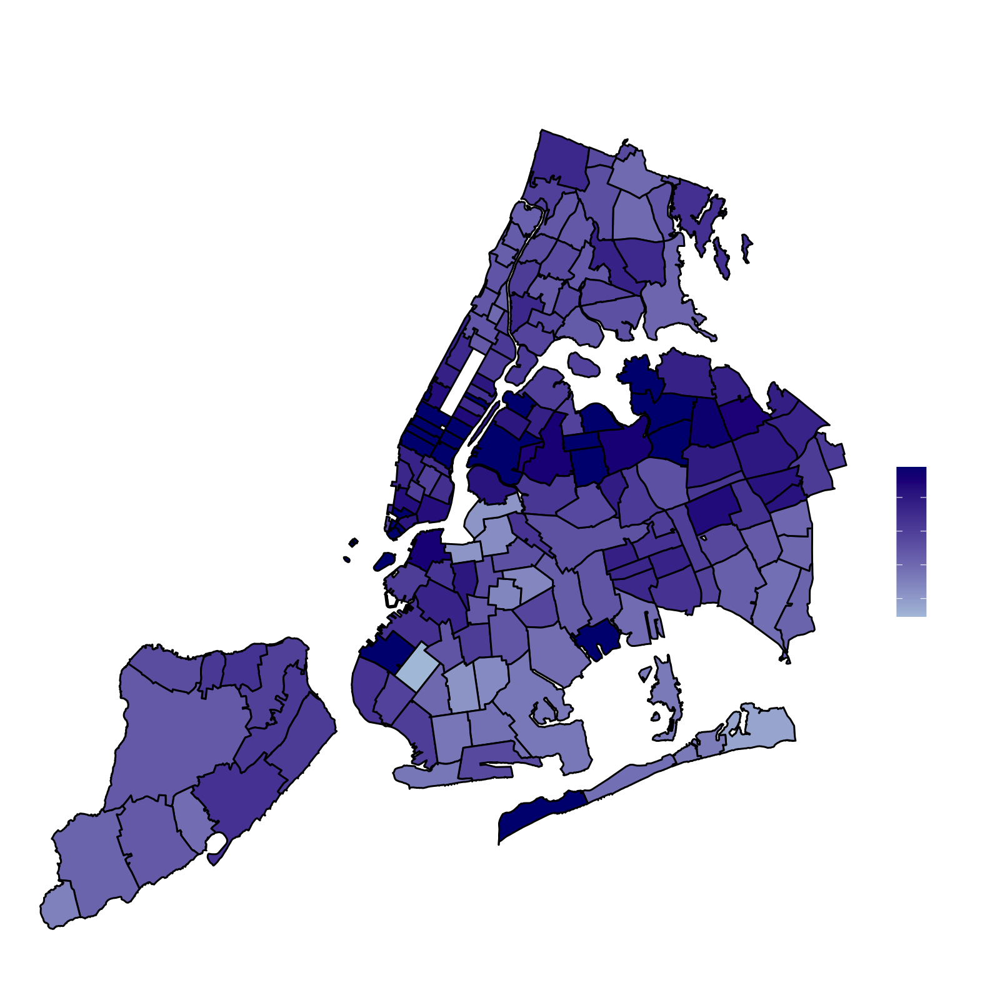
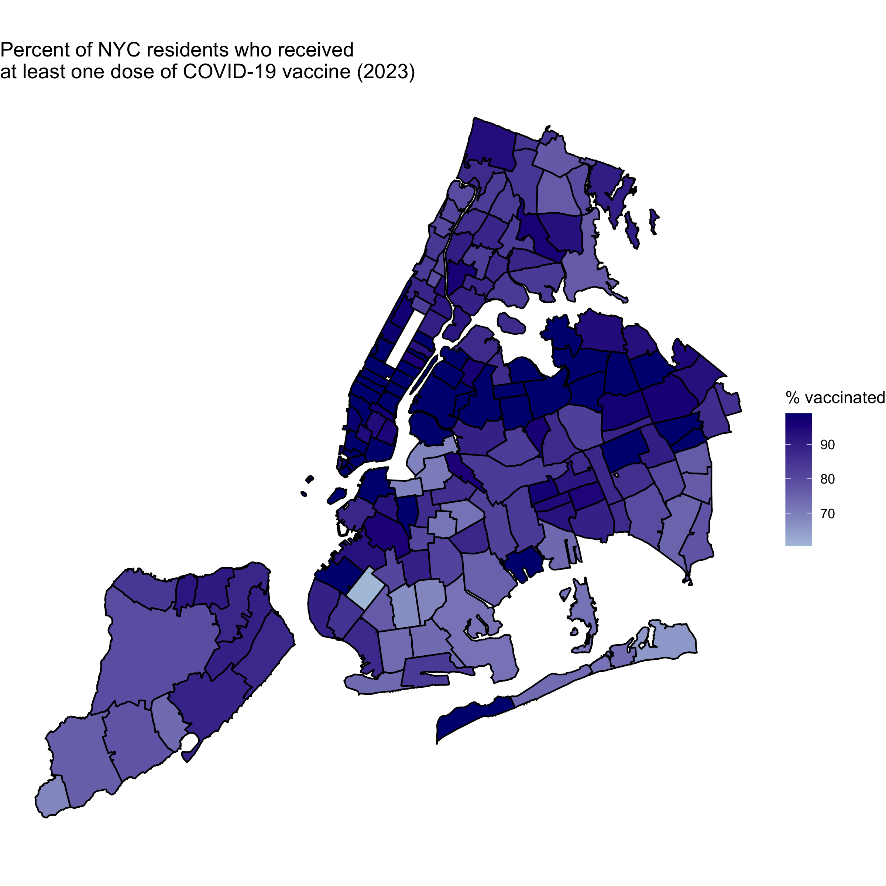
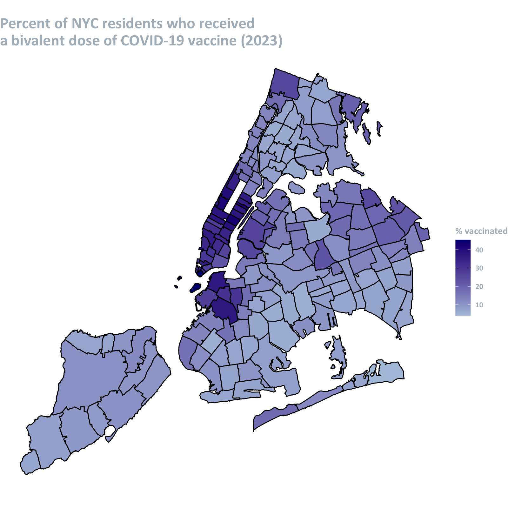

# NYC COVID-19 vaccine coverage by ZIP Code

I used data from the [NYC Department of Health and Mental Hygiene](https://github.com/nychealth/covid-vaccine-data) to map the percent of NYC residents (all ages) who received at least one dose of COVID-19 vaccine as of February 2023. Percents are displayed by Modified ZIP Code Tabulation Areas (MODZCTAs): these provide better estimates of population size than ZIP codes because they combine census blocks that have smaller populations.  
  
  
  
3 levels of coverage were compared:
 1. Residents who completed primary series
 2. Residents who received at least one dose
 3. Residents who received bivalent dose

 

  
   
   

 

